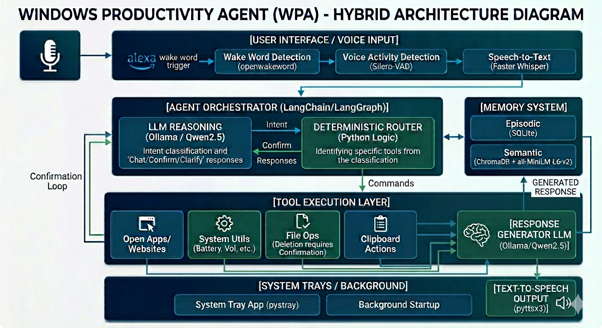

# Windows Productivity Agent (WPA)

An offline-first AI-powered Windows desktop assistant with:

- Wake word detection
- Voice interaction
- Local LLM reasoning
- Tool execution
- Memory system
- System tray integration
- Background startup support
- Fully local execution using Ollama

---

# Features

## Voice Assistant

- Wake word activation (`alexa`)
- Speech-to-text using Faster Whisper
- Text-to-speech responses
- Continuous conversation mode
- Silence detection + timeout handling

---

## Hybrid Agent Architecture

The agent uses:

- LLM for intent classification
- Deterministic Python routing
- Deterministic tool execution
- LLM for natural conversation

This gives:

- Better reliability
- Lower hallucinations
- Faster execution
- Safer automation

---

Architecture:

  

---

## Tool System

Supports:

- Open applications
- Open websites
- Battery status
- Volume control
- Clipboard actions
- File operations
- Web search
- System utilities

---

# Memory System

## SQLite Episodic Memory

Stores:

- Conversations
- Tool usage
- Responses
- Preferences

---

## ChromaDB Semantic Memory

Stores:

- User preferences
- Interaction summaries
- Semantic embeddings

Uses:

- ChromaDB
- sentence-transformers
- all-MiniLM-L6-v2

Examples:

Remember that I prefer dark mode
Remember volume at 40 percent

---

# Tech Stack

## AI

- Ollama
- Qwen2.5
- Faster Whisper
- Sentence Transformers

## Frameworks

- LangGraph
- LangChain
- ChromaDB

## Desktop

- pystray
- pyaudio
- psutil
- sounddevice
- soundfile
- openwakeword
- silero-vad
- pyttsx3
- pyperclip
- Pillow
- pygetwindow
- ddgs
- pycaw
- comtypes
- pyautogui

---

# Project Structure

Windows Productivity Agent/

├── assets/

├── logs/

├── memory/

├── notebooks/

├── tests/

│
├── src/

│     -----   └── wpa/

│       --------------     ├── agent/

│        --------------    ├── memory/

│          --------------  ├── tools/

│         --------------   ├── voice/

│          ---------------  ├── system/

│        ---------------    └── main.py

├── start_wpa.bat

├── requirements.txt

└── README.md

---

# Installation

## 1. Clone Project

git clone <your_repo_url>
cd "Windows Productivity Agent"

---

## 2. Create Virtual Environment

python -m venv .venv

Activate:

### Windows

.venv\Scripts\activate

---

## 3. Install Requirements

pip install -r requirements.txt

---

# Ollama Setup

Install Ollama:

Ollama Official Website  https://ollama.com

Pull required models:

ollama pull qwen2.5:7b

Optional lightweight classifier model:

ollama pull qwen2.5:1.5b

Verify:

ollama list

---

# Running The Agent

## Development Mode

python -m src.wpa.main

---

## Background Mode

pythonw -m src.wpa.main

---

# Startup Automation

## By Using Startup Folder

Double-click start_wpa.bat to launch WPA

( or )

Win + R → shell:startup

Place a shortcut to `start_wpa.bat` inside.

it will be automatically triggered on logging into your pc.

# System Tray

Features:

- Pause assistant
- Resume assistant
- Open logs
- Clear memory
- Exit WPA

Runs using:

- pystray
- Pillow

# Performance Optimizations

Implemented:

- Warm model loading
- Lazy memory initialization
- GPU inference
- Deterministic routing
- tool calling without using llm

---

# Current Limitations

- Windows only
- Some Store apps need special handling
- Long responses may increase latency

---

# Safety Features

Risky tools require confirmation:

Examples:

- File deletion
- Volume changes
- Clipboard overwrite
- Closing applications

Example:

Set volume to 40 percent
→ Should I proceed?

# Example Commands

## Applications

Open Chrome
Open VS Code
Open Settings
Open Task Manager

## Websites

Open YouTube
Open GitHub
Open Gmail

## System

How is my battery?
Set volume to 50 percent

Useful for:

- debugging
- startup failures
- tool execution tracing
- wake word diagnostics

---

# Author

-Venky

